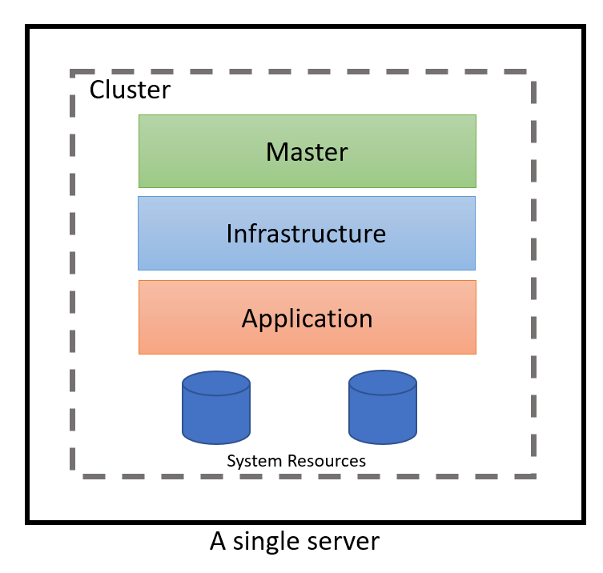
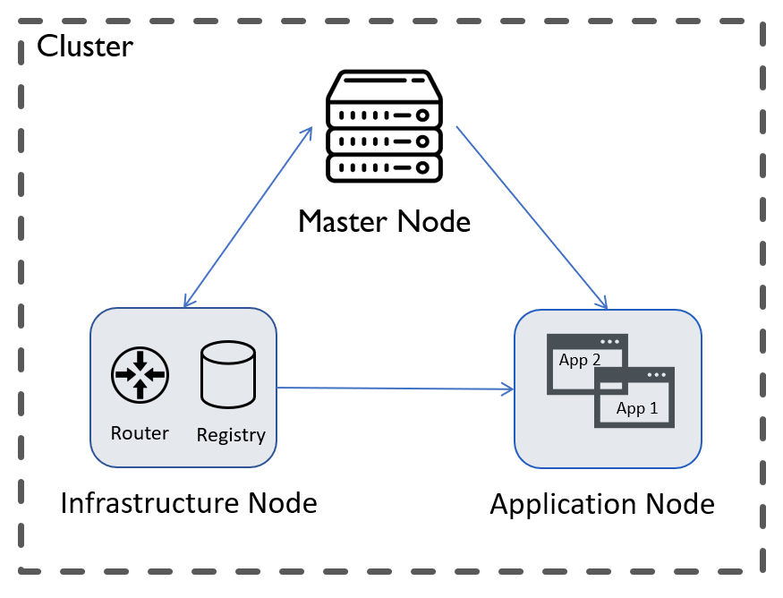
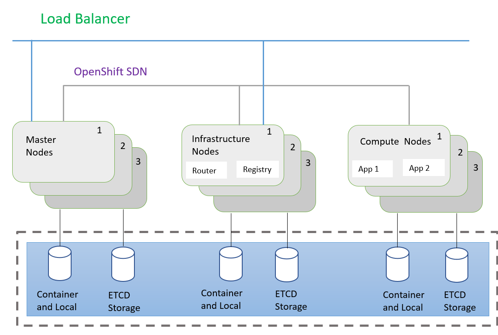
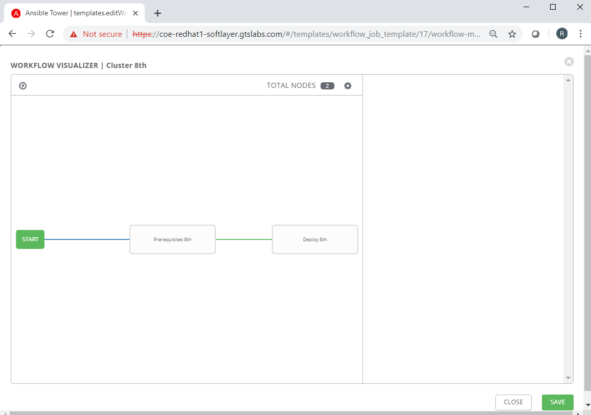

##### CHAPTER 2
# Approach

To tackle the problem, we used “OpenShift-Ansible” repository. It includes several Ansible based YAML playbooks which help to run a series of tasks using a single command. The repository contains Ansible roles and playbooks to install, upgrade, and manage OpenShift cluster. 
These playbooks perform a variety of tasks like:
-	Setup a pre-install environment for OpenShift
-	Cluster health checks
-	Etcd and HAProxy load balancer installation
-	Master OpenShift CLI installation
-	Web GUI setup
-	Installation of metrics and cluster monitoring software
-	Service catalog install

### 2.1 Introduction
Ansible is an open-source software provisioning, configuration management, and application-deployment tool. It uses its own language to describe system configurations. It can execute any number of commands using its playbooks. Playbooks are YAML scripts that defines the configurations for a machine. Ansible can execute these playbooks across a single or a group of machines simultaneously.

OpenShift cluster primarily consists of three type of nodes. These are Master, Infra and Compute. Each of the nodes consist of several essential components of the cluster. All the components are installed by the playbooks. The playbooks for OpenShift already consist scripts for all the minute configuration required by the cluster. For example, it first checks if the machines or nodes are capable of running the cluster, then it installs the packages required for using storage volumes. It also install the load balancer if we instruct it to do so through inventory file. All the configuration for cluster installation is written into this file. It consists all the information about the nodes required by the Openshift installation.

Though the playbooks perform most of the typical tasks, there are a set of pre-install configurations that need to be performed manually. These configurations depend on the requirements of the user, thus leaving these tasks to be done largely by hand. The challenge is to automate these user-specific configurations, since they vary between different scenarios. Our approach to solve the problem contains three stages:
1.	Installation of an all-in-one OpenShift cluster using playbooks
2.	Installation of a three node OpenShift cluster using playbooks
3.	Installation of a Highly Available nine-node OpenShift cluster using playbooks

### 2.2 Installation of an all-in-one OpenShift cluster

This is the simplest type of OpenShift cluster. The above diagram shows high-level architectural of an all-in-one OpenShift Cluster. In this type of cluster, the master, infra and compute, all the three reside inside a single node. This is useful for testing purposes, but not suitable for production environments. Often, storage and network aspect is ignored while installation of the cluster.

### 2.3 Installation of a three node OpenShift cluster

This is an upgraded version of an all-in-one cluster where master, infra and compute are tranferred to seperate nodes. This increases performance of each of the components. This also adds complexity to the cluster as the nodes must have a proper networking and DNS functionality along with correct mounted storage. On the other hand, this type of cluster is also not suited for production environments, because it consists of a single-point failure. If any of the nodes go down, then the entire cluster would go down since there are no duplicates of the nodes. Technically, this cluster is not highly available.

### 2.4 Installation of a Highly Available nine-node OpenShift cluster

This is a Highly Available OpenShift cluster. It's ideal number of nodes is nine. Three of which are masters, three infra and three compute. This ensures that even if one of the nodes is down, the cluster will still be up. This is a minimal HA cluster. This is a complex setup and special care has to be taken while configuring network and storage. Perfectly functioning DNS is required for it's successful installation. 

### 2.5 Workflow
Initially, all the configuration of the VMs and installation of the OCP cluster was done using linux command line. This was done through Ansible CLI tools namely, `ansible` and `ansible-playbook`. The usage is described below.
 - __Ansible ad-hoc__ command: `ansible -i inventory_file target_host_group -m ad_hoc_module -a 'arguments'`
 - Example: `ansible -i inventory nodes -m ping`
 - __Ansible playbook__ command: `ansible-playbook -i inventory_file playbook_file.yml`
 - Example: `ansible -i inventory prerequisites.yml`
 
 A much more interactive and advanced method of running and management of the playbooks is Ansible Tower. Ansible tower allows the specification of a workflow using templates that enables us to automatically setup a cluster from scratch in a single click. The operator just needs to specify the variables like number and type of hosts, their IP addresses and so on. 
 
 
 
